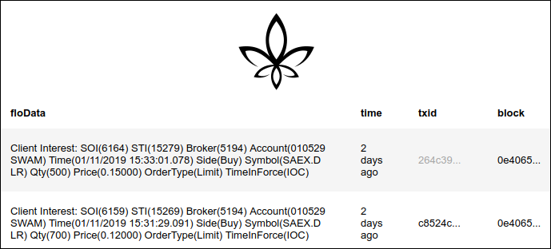

# oip-express



oip-express is a simple webapp boilerplate using expressjs, pug, and js-oip to build a single-page FLO webapp. 

## Install
```
npm install
```

## Build
Call the babel binary directly to compile js to the lib directory:
```
./node_modules/.bin/babel src --out-dir lib
```
or, use our builtin custom package script:
```
npm run compile
```

## Run
After compiling with babel, start the webserver:
```
npm start
```

For convenience, run both commands in sequence:
```
npm run compile && npm start
```

## Contents
Currently, this repo contains the Recent tZERO DLR Records webapp found at [https://floblockchain.org/tzero/](https://floblockchain.org/tzero/). 
In the future these repos will be separated and the oip-express app will contain a simple boilerplate app retrieving an unfiltered list of the latest few OIP records.

## Documentation
Documentation for packages oip-express depends on can be found in the following repositories:
* [js-oip](https://www.npmjs.com/package/js-oip) | ([github](https://github.com/oipwg/js-oip))
* [pug](https://pugjs.org/api/getting-started.html)
* [expressjs](https://expressjs.com/)

In particular, js-oip is the main driver behind oip-express; understanding how to use js-oip will allow the developer to parse the FLO blockchain and create a webapp quickly and efficiently. 

## Configuration
Configuration is done through modifying `src/index.js` at the moment. In the future a configuration file is planned. 
```
port = 3000
oip-server = snowflake.oip.fun
```
